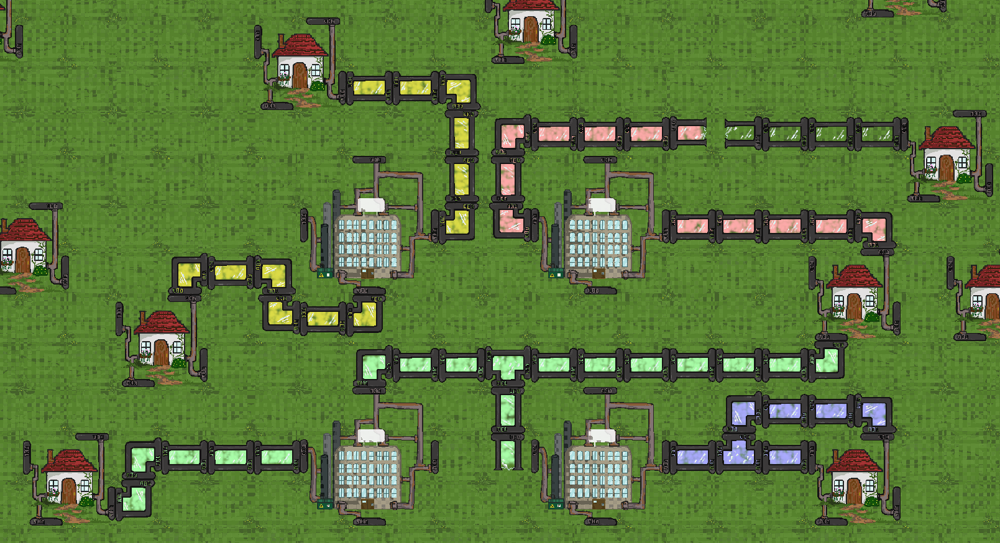

  <h>Pipe Game</h>

  

Pipe Game is a small game made for a one week game jam. Try to pipe the steam to the houses that need it before they blow up!

<a href="https://github.com/Clayton-Toste/PipeGame">Github</a>

 

  <h>Mole Game</h>

  

Mole Game is a small game I made for Mole day in high school. Dig down to collect proton and protons and neutrols to build heavier isotopes while avoiding darkmatter.

<a href="https://github.com/Clayton-Toste/Mole/tree/master">Github</a>

